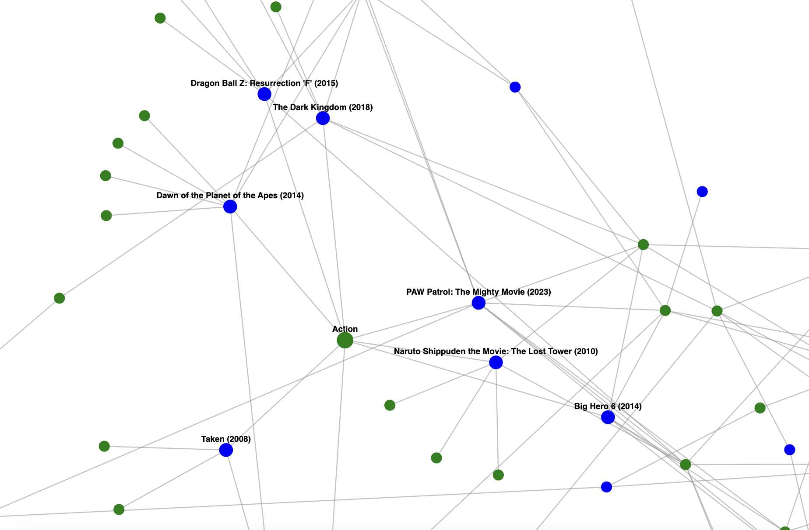
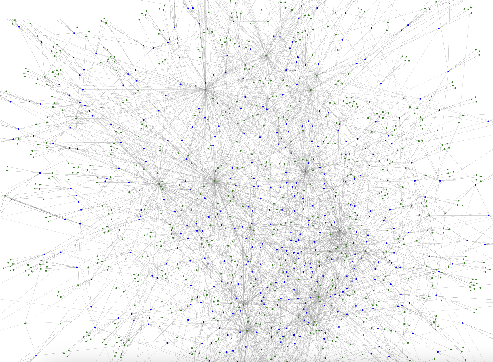
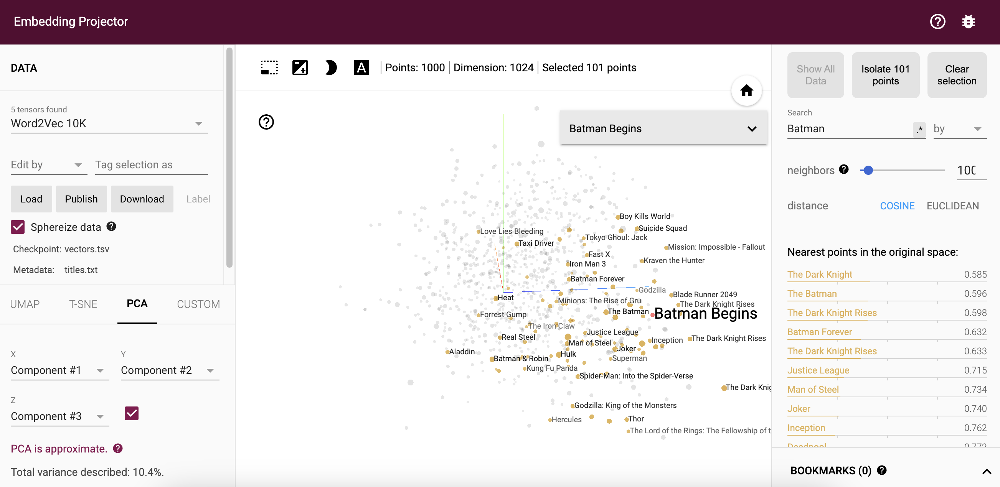

# Visualization for Graph RAG / Vector Graph

A simple visualization for how Graph RAG links and represents Data. AstraDB [Example here](https://github.com/datastax/graph-rag-example)

Built using [d3.js](https://d3js.org/)

# Get Started

[Playground](https://mukundha.github.io/graph-rag-viz/)

### Visualize Graph data in AstraDB

Export data using [`dsbulk`](https://docs.datastax.com/en/dsbulk/reference/dsbulk-cmd.html)

`./dsbulk unload -b <secure-connect-bundle.zip> -u <client_id> -p <client_secret> -query "select kind, link_from_tags, link_to_tags, metadata_s from <namespace>.<table_name> limit 100" -url ./export.csv`

Now, you should be able to load the csv file in the [Playground](https://mukundha.github.io/graph-rag-viz/)

- Sample data


- Displaying all 1000 movies


### Visualize embeddings in AstraDB

Download data using Data API

```
import os
import json
from astrapy import DataAPIClient
from dotenv import load_dotenv
import pandas as pd

load_dotenv()

client = DataAPIClient(os.environ["ASTRA_DB_APPLICATION_TOKEN"])
database = client.get_database(os.environ["ASTRA_DB_API_ENDPOINT"])
collection = database.get_collection("test1") 

docs = collection.find(projection={"title": True, "$vector": True })
df = pd.DataFrame(list(docs))
df.to_csv('data.csv',index=False, header=True)
```

Convert to Tensorboard format
```
import csv
import ast

input_csv = 'data.csv'

with open(input_csv, 'r', newline='', encoding='utf-8') as csvfile, \
     open('vectors.tsv', 'w', encoding='utf-8') as vectorfile, \
     open('titles.txt', 'w', encoding='utf-8') as titlefile:
    reader = csv.DictReader(csvfile)    
    for row in reader:        
        title = row['title']
        titlefile.write(f"{title}\n")                
        vector_str = row['$vector']
        vector_list = ast.literal_eval(vector_str)
        vector_line = '\t'.join(map(str, vector_list))
        vectorfile.write(f"{vector_line}\n")
```

- Visit - https://projector.tensorflow.org/
- Load the Vector and Titles file




### [LICENSE](LICENSE)
Apache 2.0
